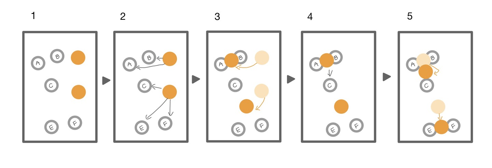

<h3>입(立) 하리</h3>
<h5>나무도 떡잎부터 자라서 오롯이 설 수 있듯이, 청년들도 경제적으로 스스로 설 수 있게.<h5>

 

## 기획 배경

##### 1. 통계청, '인구주택총조사 결과로 분석한 우리나라 청년 세대의 변화', 2023.11.27

    * 청년(19세-34세) 중 81.5%가 미혼 상태.

##### 2. 통계청, '사회조사로 살펴본 청년의 의식변화', 2023.08.28

    * 청년들이 결혼하지 않는 이유 1위
        - 결혼 자금 부족(33.7%)
        - 출산, 양육 부담(11%)
        - 고용 상태 불안정(10.2%)

##### 3. 보건복지부, '1인 가구 사회보장 수급 실태 분석', 2023.11.28

    * 1인가구 빈곤율 47.8 %
        - 그 중 청년가구 빈곤율 36.9%

##### \* 청년 가구 빈곤 실태가 심각하고, 청년 가구간 빈부 격차가 극심하여 청년들의 경제 상태 개선의 필요성을 느꼈음.

 

## 사용 언어

 

## 기획 목적

#### 청년 가구의 빈곤 실태를 해소하기 위해, 경제 상태에 알맞은 금융 상품을 추천하고 부가 소득을 얻을 수 있는 주식 정보를 제공하는 것이 목적이다.

##### 1. 금융 상품 정보 제공

    - 다양한 금융 상품에 대한 정보를 제공해, 청년들이 정보의 불균형을 해소하여 불공정한 경제적 빈곤의 격차를 줄인다.

##### 2. 금융 상품 추천

    - 청년들의 개인 자산과 급여를 바탕으로, 적절한 상품을 추천하여 효율적으로 자산관리를 할 수 있도록 돕는다.

##### 3. 커뮤니티 기능 제공

    - 여러 상품 및 금융 정보를 교환할 수 있는 커뮤니티 기능을 제공한다.

##### 4. 주식 정보 제공

    - 청년들이 얻기 어려운 주식 정보를 제공하여, 주식 현황을 파악하고 예측하는 견해를 길러 주식의 흐름을 이해하는 안목을 기르게 한다. 나아가, 주식 투자에  활용할 수 있는 다양한 도음을 준다.

 

## 주요 기능

- [ O ] 메인 페이지
- [ O ] 로그인, 로그아웃
- [ O ] 회원가입, 회원탈퇴
- [ O ] 예적금 상품 조회
- [ O ] 예적금 상세 목록
- [ O ] 커뮤니티
- [ O ] 커뮤니티 게시글, 댓글
- [ O ] 환율 계산
- [ O ] 프로필
- [ O ] 주변은행 검색
- [ O ] 금융 추천 알고리즘
- [ O ] 주식 조회
- [ O ] 주식 상세 정보
- [ O ] 주식 예측

 

## 설계 및 구현

#### 모델 설계 - ERD

- ERD Model상세 정보
 
https://ssafy-jinhyeok.notion.site/ERD-Model-e9814632024e4ca09b82b40e332c75b1?pvs=4
 

## 와이어 프레임
#### Mock-Up

- [MockUp](https://ovenapp.io/view/2bdyC1eVqBLqJRq3drdEW8dEfGKK1oVI/XPVji)

 

## 설계 및 구현

- 어떻게 이것을 구현할 것인가

 

## 금융 상품 추천 알고리즘

### K-평균 알고리즘(K-Means Algorithm)
- 비지도 학습의 대표적인 클러스터링 알고리즘 중 하나로, 데이터셋을 K개의 클러스터로 그룹화하는 데 사용된다. K-평균 알고리즘은 각 클러스터가 중심점(centroid)을 가지며, 데이터 포인트들이 가장 가까운 중심점에 할당되어 클러스터를 형성하는 방식으로 작동한다.

1 - 원하는 군집 수 만큼 임의의 군집 중심점 설정 (위 그림에서는 2개로 설정)

2 - 각 데이터는 가장 가까운 중심점에 소속

3 - 중심점에 할당된 데이터들의 평균 중심으로 중심점 이동

4 - 각 데이터는 이동된 중심점 기준으로 가장 가까운 중심점에 소속

5 - 다시 중심점에 할당된 데이터들의 평균 중심으로 중심점 이동
 

## 주식 정보 추천 알고리즘

### ARIMA(자동 회귀 이동 평균)

1. "p" (AR: 자동 회귀)

"p"는 자동 회귀 모델의 자기회귀 차수(AR 차수)를 나타냅니다.
자기회귀란 현재 시점의 데이터가 이전 시점의 데이터와 관련이 있는 경우를 의미합니다. "p"는 몇 개의 이전 시점 데이터를 사용할 것인지를 결정합니다. 예를 들어, "p=1"은 바로 직전 시점의 데이터만 사용하는 자기회귀 모델을 의미하고, "p=2"는 두 시점 이전까지의 데이터를 사용하는 자기회귀 모델을 나타냅니다.

2. "d" (I: 미분)

"d"는 미분 차수를 나타냅니다.
미분은 시계열 데이터의 추세를 제거하기 위해 데이터 간의 차이를 계산하는 과정을 나타냅니다. "d"는 몇 번의 차이를 적용할 것인지를 결정합니다. 일반적으로, 시계열 데이터가 안정적인 상태에 도달할 때까지 미분을 적용합니다.

3. "q" (MA: 이동 평균)

"q"는 이동평균 모델의 이동평균 차수(MA 차수)를 나타냅니다.
이동평균은 현재 시점의 데이터가 과거 시점의 랜덤한 오차 항에 의해 영향을 받는 경우를 나타냅니다. "q"는 몇 개의 이전 시점의 오차 항을 고려할 것인지를 결정합니다.

ARIMA 모델은 세 가지 구성 요소인 자기회귀(AR), 차분(I), 이동평균(MA)을 결합하여 시계열 데이터의 패턴을 설명합니다.

 

## 기대 효과
### 개인 맞춤 금융상품 추천
- 사용자의 나이와 월급을 고려하여 유사한 고객들이 선택한 상품을 추천함으로서 사용자의 환경을 고려한 상품을 일찍 알고 가입할 수 있다.

### 보다 가까운 은행 찾기
- 가까운 은행을 찾음으로서 금전적인 관리 및 금융상품 상담, 가입을 빠르게 시행할 수 있다.

### 가까운 시일의 주가 예측
- 과거의 주식데이터를 분석하여 미래의 주가를 예측함으로서 주식 선택에 보다 신중하게 판단할 수 있다.

### 원활한 소통의 장 커뮤니티
- 다양한 사람들과 소통하며 다양한 정보를 얻을 것으로 기대된다.
 

## 팀 구성

|           |                                                                                                      김호경                                                                                                       |                                                                                                      황병현                                                                                                       |
| :-------: | :---------------------------------------------------------------------------------------------------------------------------------------------------------------------------------------------------------------: | :---------------------------------------------------------------------------------------------------------------------------------------------------------------------------------------------------------------: |
|  소개글   |                                                            안녕하세요, 데이터 분석이 즐거워, 데이터 엔지니어를 꿈꾸고 있는 주니어 개발자 김호경입니다.                                                            |                                                                  AI백엔드가 메인 빅데이터 분석을 서브로 역량을 키우고 싶은 개발자 황병현입니다.                                                                   |
|  연락처   |                                                |                                                   |
| 역할 분담 | 백엔드 모델 설계, 백엔드 경로 설정, 프론트엔드 경로 설정, 프론트엔드 store 설정, 프론트엔드 지도 구현, 프론트엔드 환율 계산기 구현, 프론트 엔드 CSS 작업, README 작성, 메인페이지 구현, 페이지 헤더 및 푸터 구현, | 백엔드 모델 설계, 백엔드 경로 설정, 백엔드 데이터 제작, 백엔드 함수 구현, 백엔드 금융 추천 알고리즘 및 주식 기능 구현, 프론트 엔드 유저 기능 구현, 프론트엔드 게시글 및 상품 출력 기능, 댓글 기능 구현, 챗봇 구현 |

 

## 진행 현황
https://www.notion.so/ssafy-jinhyeok/D304-fd0c0863b0fc48d29e6d921a4afc459d?pvs=4
 

## 느낀 점
### 김호경
- 모델을 설계하고 구체화하면서, 머리속에서 그려지는 듯한 연결 과정들이 정말 재미있었습니다. 비록 촉박한 시간 속에서 업무를 분담하기 위해 프론트 위주로 작업을 진행했지만, 다음에는 백엔드 업무에 좀 더 집중하고 싶습니다. Vue에서 데이터를 다듬고 배치하는 과정도 즐거웠지만, 데이터베이스를 직접 다루는 과정이 아직 좀 더 재미있다고 생각합니다. 이번 프로젝트를 진행하며 장기간 협업하며 완전한 업무 분담을 경험할 수 있어 새로웠고, 코드를 보는 눈과 전개하는 실력을 기를 수 있어 좋았습니다.

### 황병현
- 모델을 설계하고 구현하하면서 많은 수정을 이루었지만 모든 것이 연결되고 구동되었을 떄 자부심을 느꼈습니다. 또한 데이터 분석한 결과를 vue를 통해 그래프를 출력하는 것에 제가 목표로 하고 있는 서비스 구현을 할 수 있는 역량을 기르게 되었습니다.

